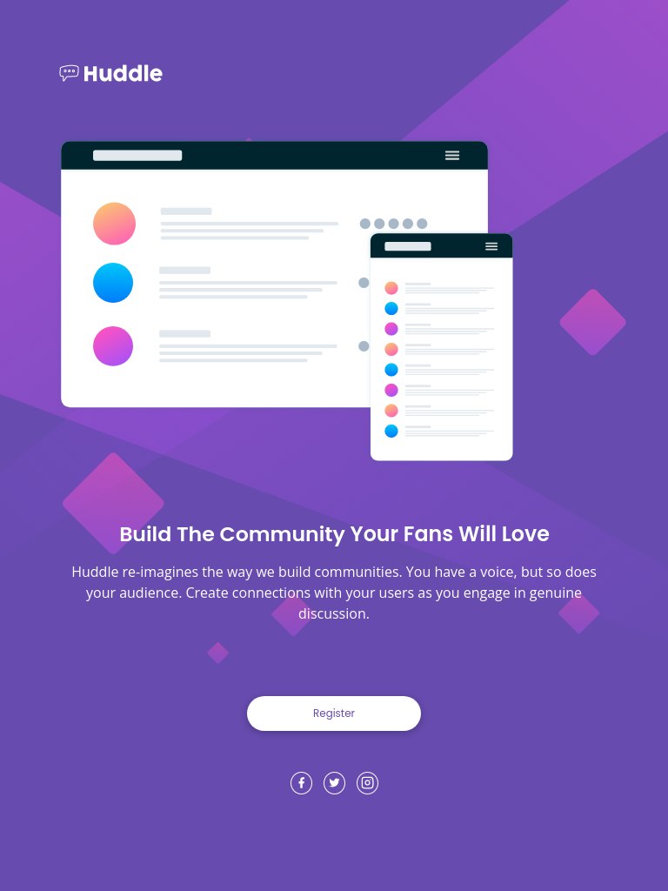
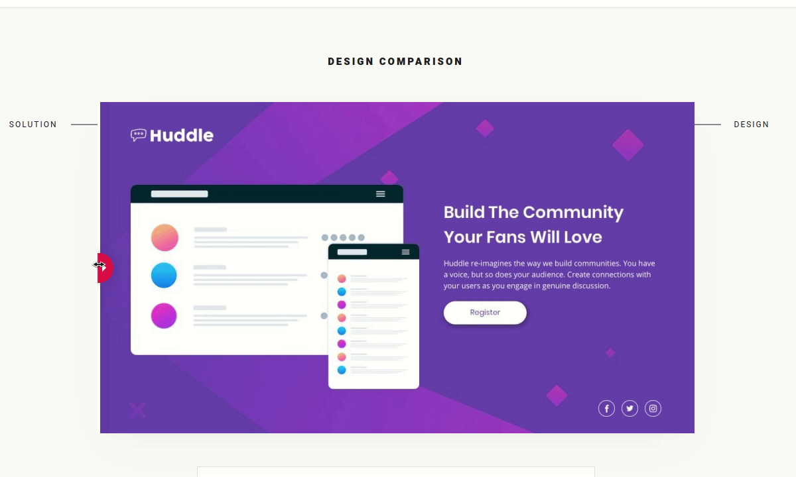

# Frontend Mentor - Huddle landing page with single introductory section solution

This is a solution to the [Huddle landing page with single introductory section challenge on Frontend Mentor](https://www.frontendmentor.io/challenges/huddle-landing-page-with-a-single-introductory-section-B_2Wvxgi0). Frontend Mentor challenges help you improve your coding skills by building realistic projects.

## Table of contents

- [Overview](#overview)
  - [The challenge](#the-challenge)
  - [Screenshot](#screenshot)
  - [Links](#links)
- [My process](#my-process)
  - [Built with](#built-with)
  - [What I learned](#what-i-learned)
  - [Useful resources](#useful-resources)
- [Author](#author)

## Overview

This is the front-end mentor's eighth challenge. The challenge is to build the "Huddle landing page with single introductory section" and make it as close to the design as possible. Building the desing with whatever you want to finish, any language, framework or tools.

### The challenge

Users should be able to:

- View the optimal layout for the page depending on their device's screen size
- See hover states for all interactive elements on the page

## Screenshot

### Mobile design

<p  align="center">
  </img>
</p>

### Tablets design

<p  align="center"></img></p>

### Desktop design

<p  align="center"></img></p>

### result of my work

<p  align="center"></img></p>

### Links

- Solution URL: [My solution for this challenge](https://www.frontendmentor.io/solutions/huddle-landing-page-with-react-and-react-icons-5Rh-M2M9C)
- Live Site URL: [check the result](https://jcdmeira-huddle-lp.netlify.app)
- My figma design: [Figma](https://www.figma.com/file/83tOo71IOWw4TwijRljgdz/08---Huddle-LP?node-id=0%3A1)

## My process

### Built with

- Flexbox
- Mobile-first workflow
- [React Icon](https://react-icons.github.io/react-icons/) - library with popular icons
- [React](https://reactjs.org/) - JS library

### What I learned

Using react icons library

```JSX
  import { RiFacebookFill } from 'react-icons/ri';

<RiFacebookFill
  className="icon"
  size={widthDevice > 1023 ? 22 : 15}
  color="#fff"
/>
```

### Useful resources

- [react tutorial](https://pt-br.reactjs.org/tutorial/tutorial.html) - This helped me structure the components and build the proposed page.
- [my figma design](https://www.figma.com/file/83tOo71IOWw4TwijRljgdz/08---Huddle-LP?node-id=0%3A1) - My figma design for help anyone who wants to build this challenge.
- [CSS units conversor - px to VH/VW/REM](https://it-news.pw/pxtovh/) - CSS units conversor .
- [Converting Colors](https://convertingcolors.com) - HSL for all color systems.
- [React Icon](https://react-icons.github.io/react-icons/) - library with popular icons

## Author

- Personal Page - [Jean Carlos De Meira](https://jcdmeira.github.io)
- Frontend Mentor - [@JCDMeira](https://www.frontendmentor.io/profile/JCDMeira)
- Instagram - [@jean.meira10](https://www.instagram.com/jean.meira10/)
- GitHub - [JCDMeira](https://github.com/JCDMeira)
